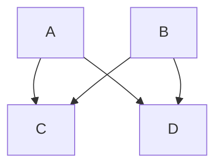
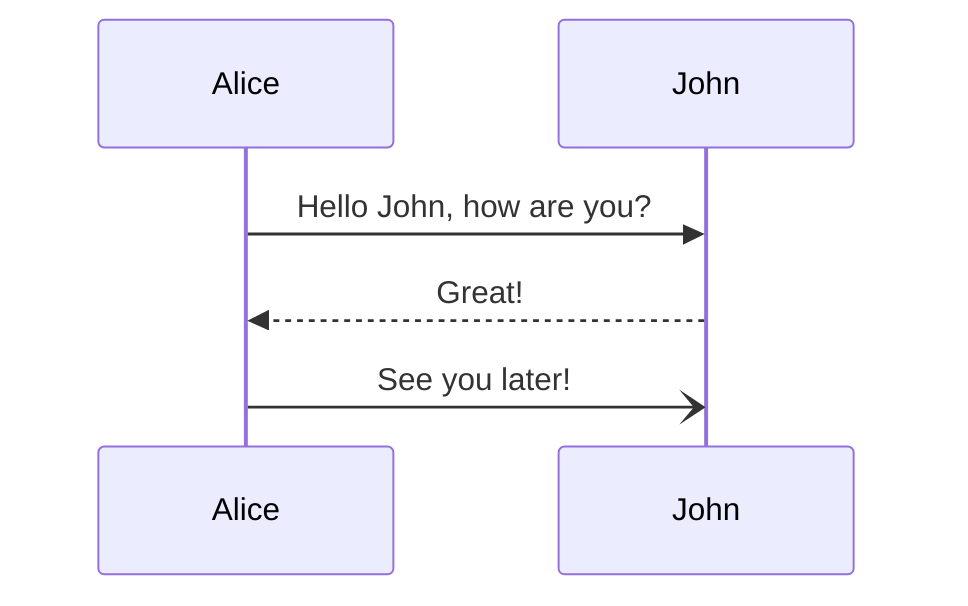
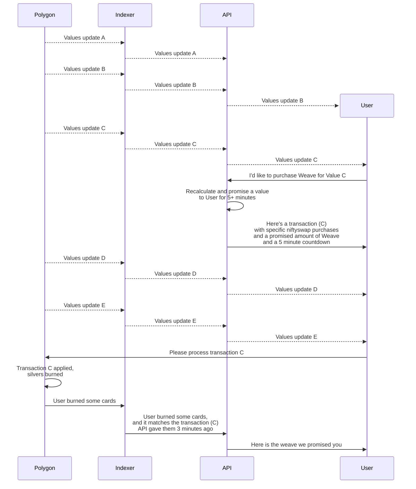

# Examples

## Mermaid

[Sequence Overview](sequence-overview)

### flowchart

```mermaid
flowchart TB
    A & B--> C & D
```
### sequence diagram

```mermaid
sequenceDiagram
    Alice->>John: Hello John, how are you?
    John-->>Alice: Great!
    Alice-)John: See you later!
```

### sequence diagram 2

```mermaid
sequenceDiagram
    Polygon-->>Indexer: Values update A
    Indexer-->>API: Values update A
    Polygon-->>Indexer: Values update B
    Indexer-->>API: Values update B
    create participant User
    API-->>User: Values update B
    Polygon-->>Indexer: Values update C
    Indexer-->>API: Values update C
    API-->>User: Values update C
    User->>API: I'd like to purchase Weave for Value C
    API->>API: Recalculate and promise a value <br>to User for 5+ minutes
    API->>User: Here's a transaction (C)<br>with specific niftyswap purchases<br>and a promised amount of Weave<br>and a 5 minute countdown
    Polygon-->>Indexer: Values update D
    Indexer-->>API: Values update D
    API-->>User: Values update D
    Polygon-->>Indexer: Values update E
    Indexer-->>API: Values update E
    API-->>User: Values update E
    User->>Polygon: Please process transaction C
    Polygon->>Polygon: Transaction C applied,<br>silvers burned
    Polygon->>Indexer: User burned some cards
    Indexer->>API: User burned some cards,<br>and it matches the transaction (C)<br> API gave them 3 minutes ago
    API->>User: Here is the weave we promised you
```
