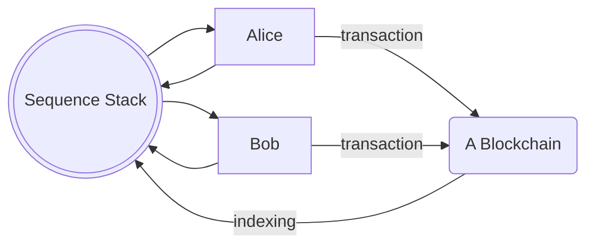

# Sequence Stack

## The flow of information

```mermaid
flowchart LR

S(((Sequence Stack)))
B(A Blockchain)

Ua[Alice]
Ub[Bob]

Ua --> S
S --> Ua
Ub --> S
S --> Ub

Ua --> |transaction| B
Ub --> |transaction| B

B --> |indexing| S
```